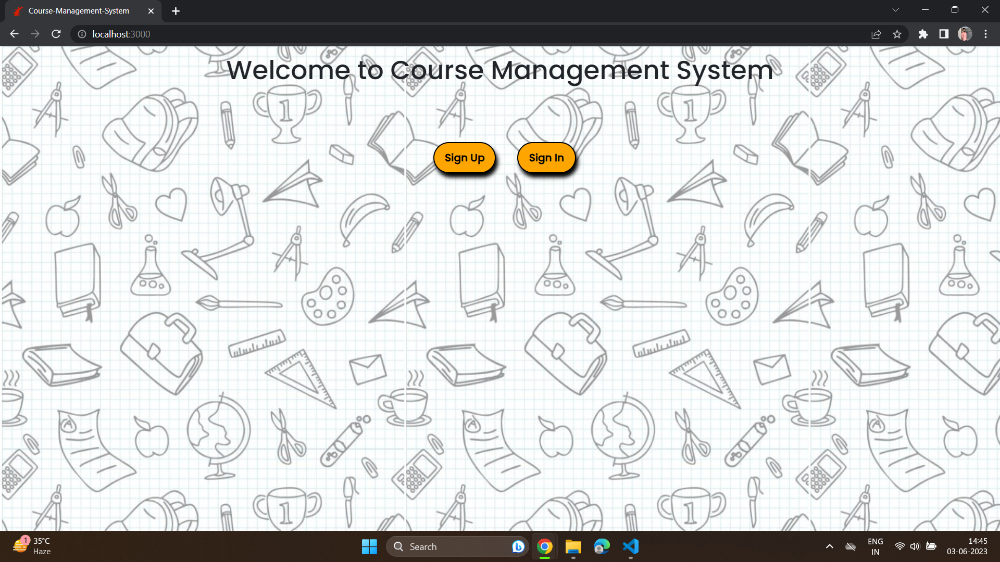
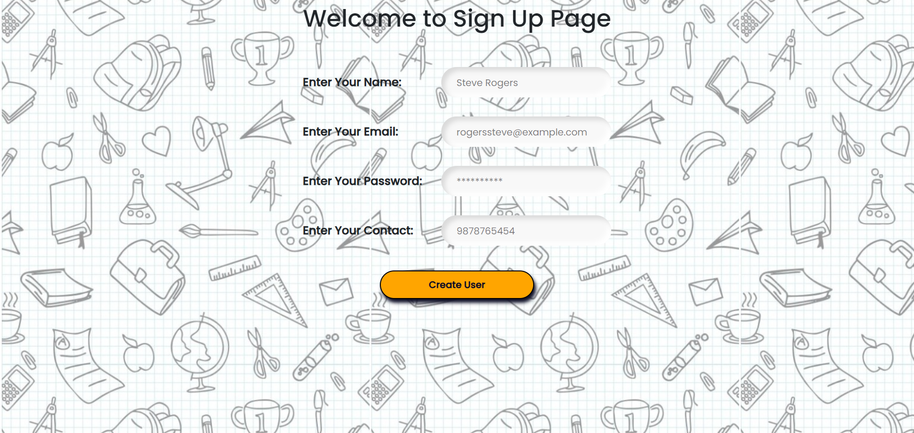
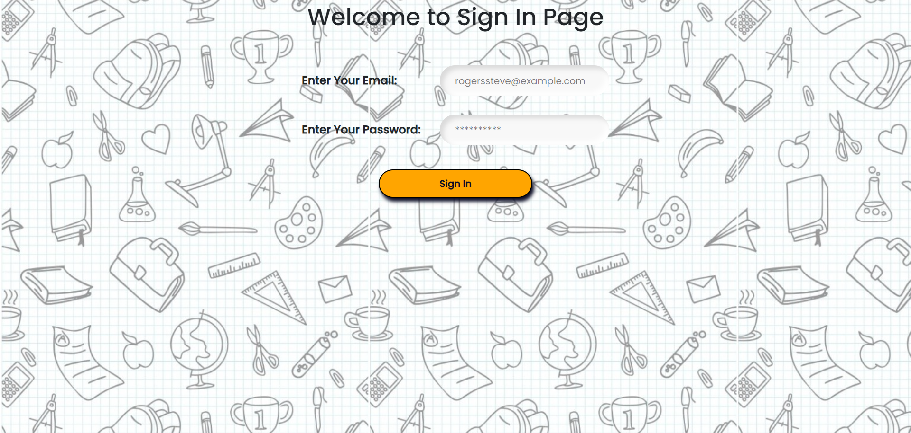
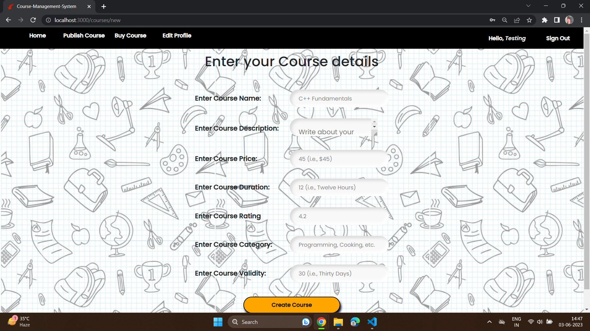
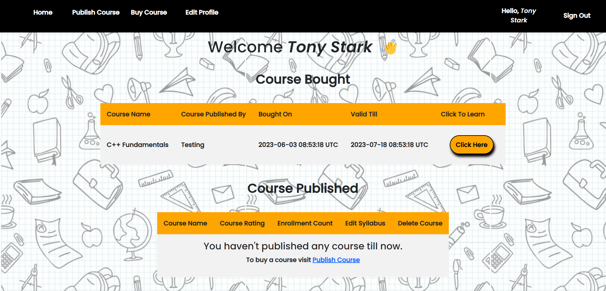
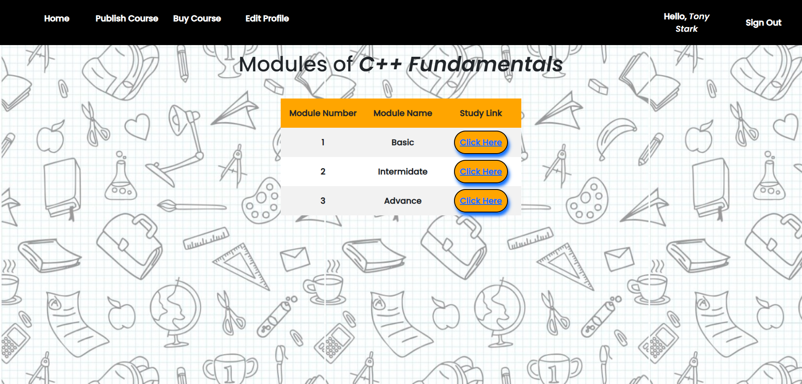
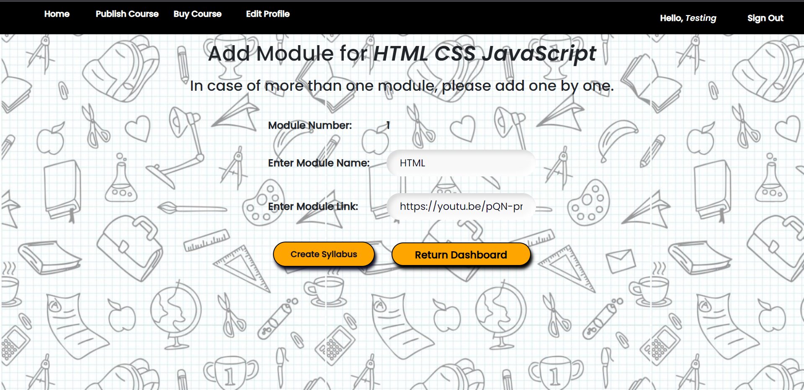
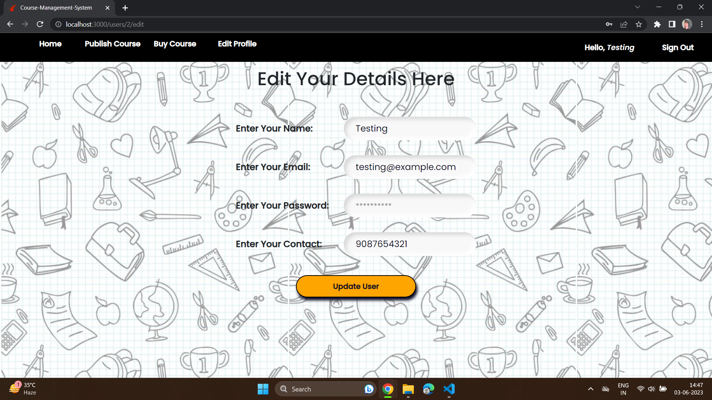

# Course Management System Using Rails

## Output ScreenShot

 

### Welcome Page:

 

### Sign Up:

 

### Sign In:

 

 

### Dashboard:

 

### Course Available:

 

### Course Published:

 

### Course Bought:

 

### Course Module:

 

 

### Create Module:

 

### Editing Profile:

