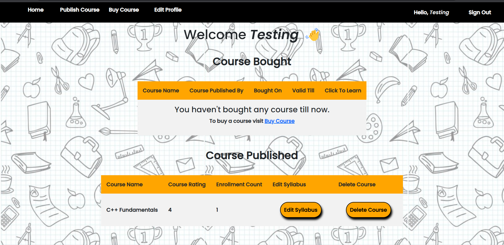
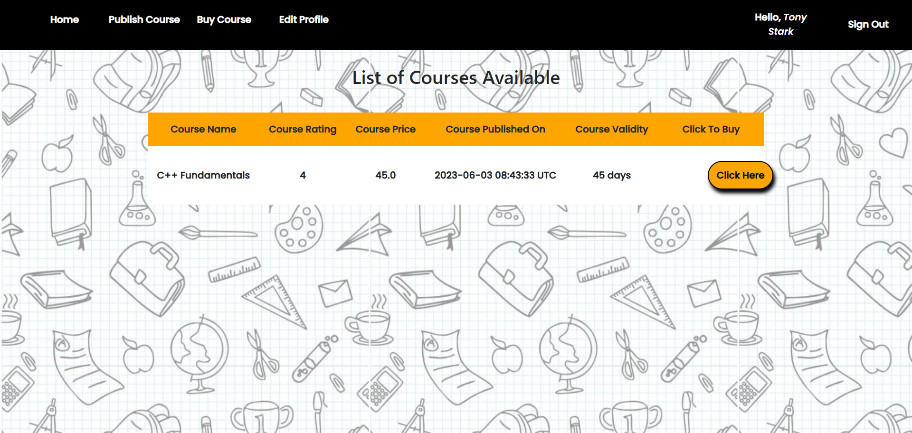
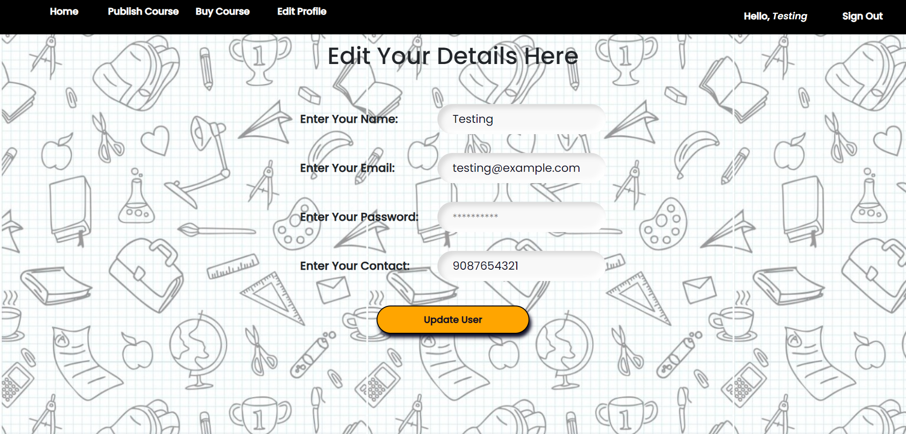

# Course Management System Using Rails

Created a Course Management System using Rails as framework. It is an Full Stack Web Application in which user and buy as well as can publish courses.

## Features

- Sign-Up and Sign-In feature is added in which the password is also encryted and the loggin process is handle using session.
- User can buy and publish the courses.
- Constraint is also where the users can't buy the course they have already bought.
- User can also delete there published courses if they want to.
- Syllabus module is also available.
- Similary user can't buy the course they have published.
- Edit Profile feature is also provided.

## Install and Run

- To run this application in your system, you must have a rails environment. Follow the instructions provided on the offical website to setup and `Ruby on Rails` Environment.

- Clone the respository or download teh zip folder.
- Install all the required dependencies with the bundler use command `bundle install`
- After successfull installation of dependencies run `rails db:migrate` command to setup the database.
- Now run `rails server` to run the project in your local.

## Reference

- Refer the link <a href="https://guides.rubyonrails.org/getting_started.html" target="_blank"> Getting Started with Rails </a> to understand the rails working

## Output ScreenShot

 

### Welcome Page:

 

### Sign Up:

 

### Sign In:

 

 

### Dashboard:

 

### Course Available:

 

### Course Published:

 

### Course Bought:

 

### Course Module:

 

 

### Create Module:

 

### Editing Profile:

 

### My Orders:

 
